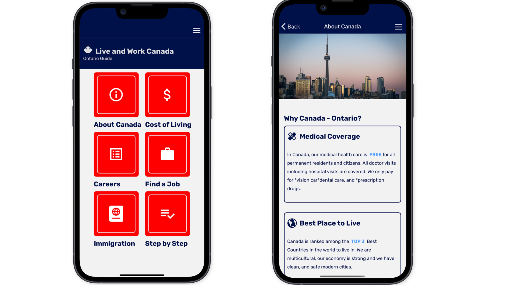
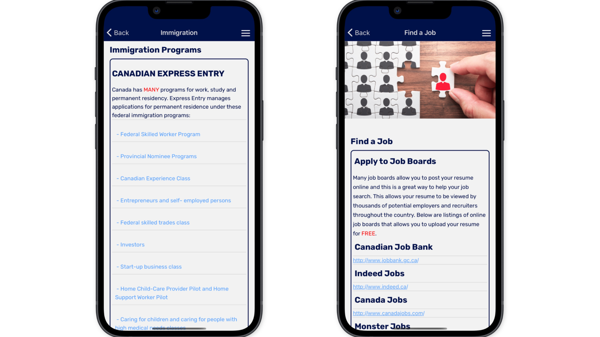

# Motivational Quotes App

## Table of Contents
- [Installation](#installation)
- [App Features](#app-features)
- [Contributing](#contributing)
- [Conclusion](#conclusion)

## Introduction

Live and Work Canada is a React Native app that provides information about studying and costs of living in Canada from different provinces. This app is designed to help people who are planning to study or work in Canada, and want to know more about the various costs associated with living in different parts of the country.

## Installation

To use the Live and Work Canada app, you'll need to install React Native on your computer. Once you have React Native installed, you can download the app from GitHub and run it on your local machine. Follow these steps:

1. Clone the repository from GitHub using the following command:
`git clone git@github.com:alanhcrdz/liveandworkcanada.git`
2. Navigate to the project directory using the following command:
`cd liveandworkcanada`
3. Install the project dependencies by running the following command:
`npm install`
4. Start the app by running the following command:
`npx expo start`

5. Once the app is started, you can run it on an Android or iOS simulator or on a physical device.

## App Features

The Live and Work Canada app includes the following features:

- Information about different provinces in Canada
- Cost of living comparison between provinces
- Details about studying in Canada, including tuition fees and living expenses
- Contact information for universities and colleges in Canada

## Usage

To use the Live and Work Canada app, simply open the app on your device and browse through the different provinces to find information about costs of living and studying in Canada. You can also use the app to contact universities and colleges in Canada if you have any questions.

## Contributing

If you would like to contribute to the Live and Work Canada app, please submit a pull request with your changes. We welcome contributions from the community and appreciate your help in making this app even better.
